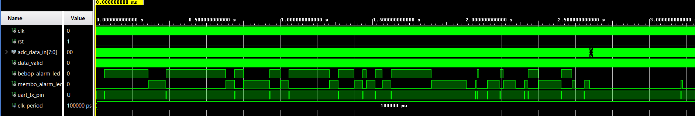
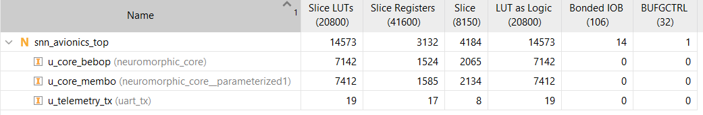
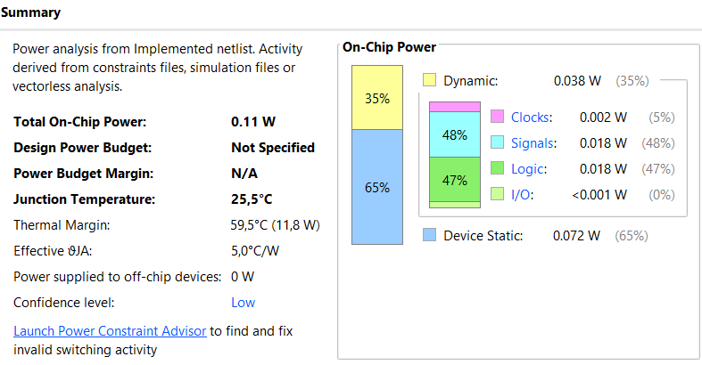
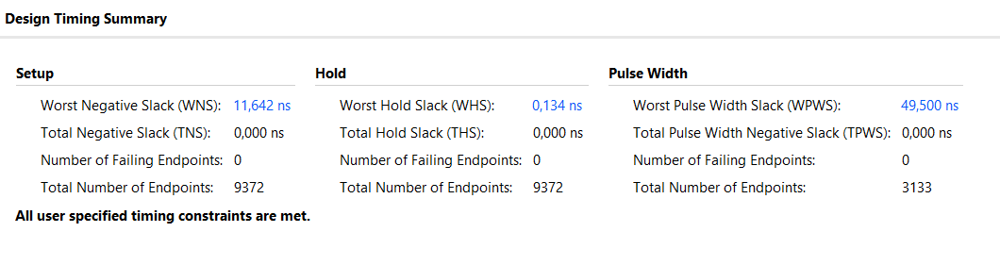
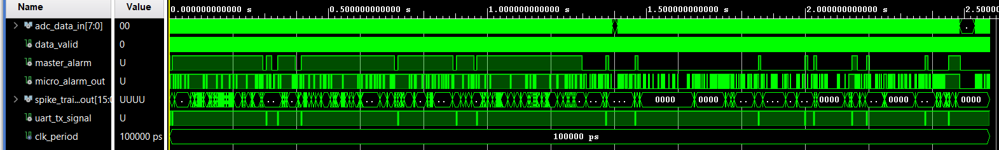
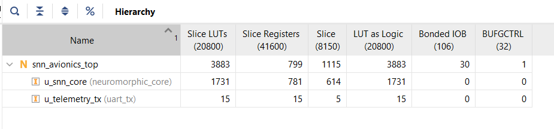
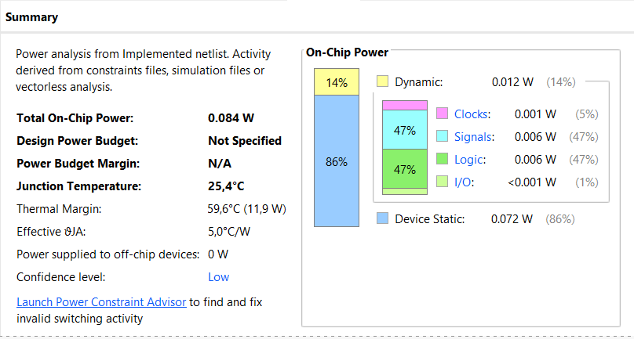
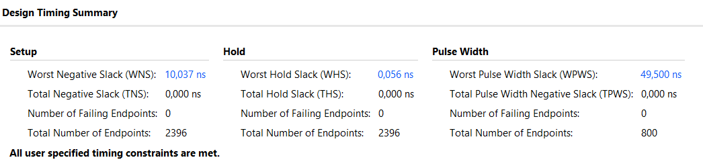

# Asymmetric Dual-Core Neuromorphic Radar (C-UAS)
**Author:** Ömer Fazıl Orhan (Abdullah Gül University - EE Engineering)

## Project Overview
This repository contains the software-hardware co-design of a Dual-Core Spiking Neural Network (SNN) optimized for acoustic Counter-Unmanned Aerial Systems (C-UAS). Designed for extreme power efficiency and low-latency FPGA deployment, this system processes raw audio waveforms to detect and classify different drone signatures (e.g., heavy rotors vs. high-pitched micro-drones) in high-noise wind environments.

## Engineering Highlights
* **Hostile Negative Mining:** Overcame critical acoustic cross-pollination by training a low-frequency SNN core (Bebop) to mathematically ignore high-frequency drones via a 3.0x False Alarm Rate (FAR) evolutionary penalty.
* **Asymmetric Priority Logic:** Replaced fragile digital audio filters (high-pass pre-emphasis) with a raw-audio Dual-Core VHDL multiplexer. The broadband core (Bebop) serves as a baseline, while the highly-sensitive sniper core (Membo) is hardware-overridden during acoustic blowouts.
* **Track-While-Scan (TWS) Coincidence:** Replaced single-window hair-triggers with a temporal sliding window ($W=5$), requiring sustained resonance to obliterate transient wind noise, achieving **98.1% Noise Specificity**.

## Repository Structure
* `/data` - (GitIgnored) Raw audio and train/test splits.
* `/src` - Python training engines, Lamarckian Genetic Algorithms, and Pareto evaluation sweeps.
* `/weights` - Compiled 8-bit integer `.npy` weight matrices for the SNN cores.
* `/hw` - VHDL source code, testbenches, and Vivado project files.
* `/docs` - System architecture diagrams and Fisher Discriminant Analysis logs.

## Deployment Architecture
* **Input:** Raw 16kHz audio $\rightarrow$ 15.5ms Micro-Windows (248 samples).
* **Integration:** 64-frame Macro-Windows (0.99 seconds).
* **Tracking:** 5-frame Temporal Coincidence Sliding Window.

## 🛠️ Hardware Implementation & Vivado Projects

The VHDL source files, testbenches, and XDC constraints are located in the `hw/` directory. Due to the massive file sizes of compiled FPGA binaries and cache files, the fully synthesized and routed Vivado projects are hosted externally.

You can download the complete, ready-to-run Vivado projects (including synthesis reports, routed checkpoints, and generated bitstreams) from the following link:

📦 **[Download Compiled Vivado Projects (Google Drive)](https://drive.google.com/drive/folders/1KPft4jT-i0KJ37-gRoeLCIIZLi-E8B_v?usp=sharing)**

### Project Archive Contents:
The archive contains 4 completed project runs, allowing you to instantly deploy the neural networks to the Artix-7 fabric or review the timing and utilization closures without needing to rerun the lengthy synthesis and implementation pipelines.

### Vivado Hardware Results:
**Merge**
* **Simulation Results:**

* **Post Implemenation Utilization Results:**

* **Post Implemenation Timing Power:**

* **Post Implemenation Timing Results:**

**Single Core Bebop**
* **Simulation Results:**

* **Post Implemenation Utilization Results:**

* **Post Implemenation Timing Power:**

* **Post Implemenation Timing Results:**
